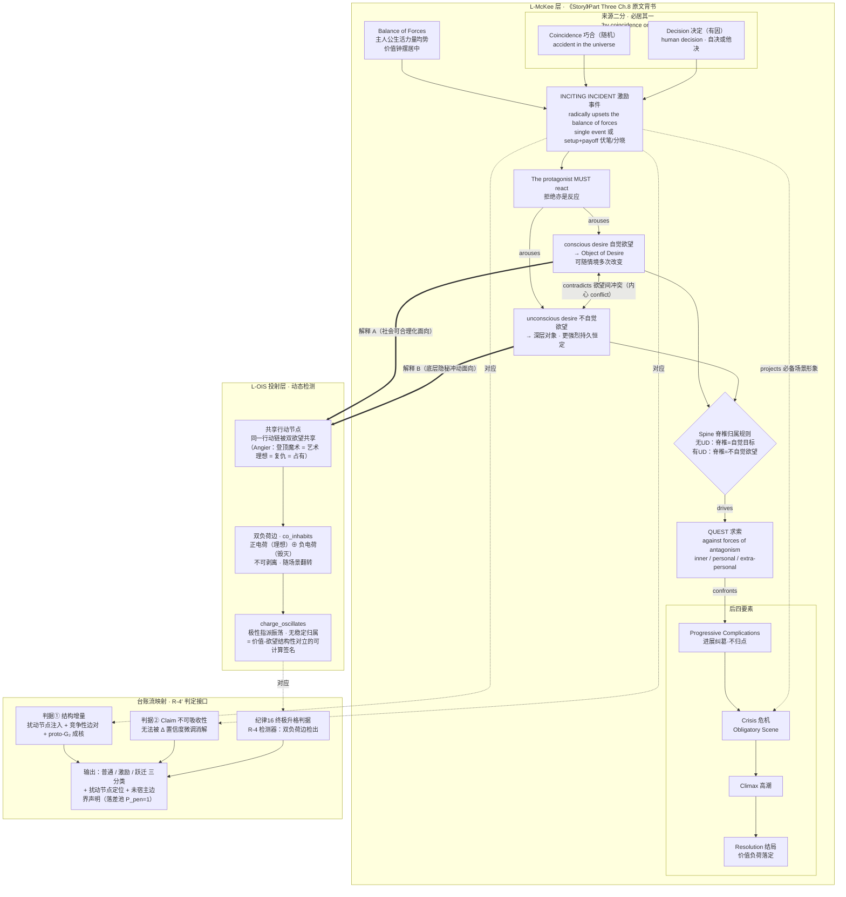

# OIS 工程实践：激励事件图结构 v1.0（签付版）——R-4′ 开题底图

**版本**：v1.0（签付版）
**签发日期**：2026-09-29
**性质**：R-4′（激励事件识别，台账流激励事件判定）的叙事学底图与图结构设计文档。McKee 层为外部文本的结构化整理（经英文原文校准）；L-OIS 投射层为体系内推导，其正确性由模块六原型实证检验（P6 通道），与《OIS-P2-P3开工闸门报告-v1.2（签发版）》§九性质条款一致。
**版本说明**：本版合并 v0.1（初步图结构）、v0.2（英文原版校准版）、v0.3（价值极性暧昧校准版）三版未签发稿定稿签发。三版迭代史——初步建模 → 原文校准（章节定位修正、价值-欲望静态耦合剥离）→ 投射层形态修订（静态指派 → 动态检测）——作为写作史留存，不构成本版生效结构。
**上游依据**：《OIS-P2-P3开工闸门报告-v1.2（签发版）》§九（R-4′）（Handle：`oi:compendium/gate-check-p2p3-v1.2/20260928`）；Robert McKee, *Story: Substance, Structure, Style, and the Principles of Screenwriting* (HarperCollins, 1997), Part Three "The Principles of Story Design", Chapter 8 "The Inciting Incident"（价值轴另参 Ch.6 "Structure and Meaning"）；《价值极性暧昧（Ambiguity of Value Polarity）——结合〈致命魔术〉+ McKee〈故事〉框架解释》（研究笔记，2026-09-29，体系内工作定义，未经外部文献回证）。

---

## 一、McKee 原著校准记录（英文原文基准）

### 1.1 章节定位

《The Inciting Incident》为英文原版 **Part Three "The Principles of Story Design" 之 Chapter 8**（Part Two 为 "The Elements of Story"，Ch.2–6）；中译本（周铁东译）第三部分第八章，部次一致。早期工作表述"Part2 Chapter08"已修正。

### 1.2 原文关键句（校准基准）

1. **定义句**："The INCITING INCIDENT radically upsets the balance of forces in the protagonist's life."（1997 版 p.189）
2. **反应强制**："The protagonist must react to the Inciting Incident."（拒绝亦是一种反应）
3. **来源二分**：书中表述 "by coincidence or by decision"；McKee 访谈平行表述："an event, either by human decision or accident in the universe, radically upsets the balance of forces in the protagonist's life, arousing in that character the need to restore the balance of life."
4. **欲望激发与求索**："All stories take the form of a Quest. For better or worse, an event throws a character's life out of balance, arousing in him the conscious and/or unconscious desire for that which he feels will restore balance, launching him on a Quest for his Object of Desire against forces of antagonism."
5. **三层对抗**：forces of antagonism —— **inner**（内心）／**personal**（个人关系）／**extra-personal**（个人外：社会机构与物质环境）。
6. **脊椎（Spine，又称 through-line / super-objective）**：简单人物的脊椎即自觉目标；复杂人物的脊椎是不自觉欲望——恒定不变，而自觉欲望可随情境多次改变（Ishmael 例；学术转引另见西语论文引 McKee 1997 p.233）。
7. **构成与定位**：激励事件为动态的、充分发展的事件——单一事件，或 setup＋payoff（伏笔＋分晓）双事件（分晓不得拖延）；主情节激励事件必须发生在银幕之上，并向观众想象投射必备场景（Obligatory Scene）形象。

### 1.3 三层权属划分（v0.3 精化，生效）

| 构件 | 权属 | 依据 |
| --- | --- | --- |
| 价值二元轴（正/负电荷，可翻转，场景以价值转换为最小单位） | **McKee 原文** | *Story* Ch.6：story values 为人类经验的二元品质，在正负电荷间转换 |
| 欲望分层（conscious／unconscious）及双欲望互相矛盾（contradict each other） | **McKee 原文** | Ch.8 |
| 价值极性 ↔ 欲望分层的**静态耦合**（自觉＝正价值、不自觉＝负价值；如"爱情＝正／占有＝负"） | **OIS 投射层** | 原文无此绑定；Ch.6 与 Ch.8 两条轴在原著中从未耦合 |

即：OIS 未引入外来维度，而是**重组了 McKee 体系内两条原本分离的轴**——投射层的第一重逻辑合理性：构件全部有出处，新颖性仅在组合方式。

### 1.4 案例校验（《The Prestige》）

学术文献对《致命魔术》的 McKee 式分析印证图式可用：激励事件＝Julia 溺亡（radically upsets the balance）；激发 Angier 的 conscious desire＝成为最伟大魔术师并向 Borden 复仇，launching him "on a Quest for his Object of Desire against forces of antagonism"（引 McKee p.197）；不自觉层面可由台词 "I saw happiness…happiness that should have been mine" 读出——占有式深层欲望。该例展示：自觉欲望（复仇/成就）与不自觉欲望（占有幸福）均为**执念**，价值极性暧昧——佐证 §一.1.3：价值正负不能从原文推出，只能作为 OIS 建模层单独处理。

## 二、价值极性暧昧与投射层逻辑论证（生效）

### 2.1 论证链

- **P1（McKee 层）**：价值二元可翻转；欲望分层无价值绑定；多维人物的自觉与不自觉欲望互相矛盾。
- **P2（暧昧研究层）**：执念（obsession）案例中，双欲望**共享同一行动链**；同一欲望对象同时承载正负两极价值，互为前提、无法剥离；极性不存在稳定、单向的判定（Angier：登顶"最伟大魔术"同时是艺术理想·正、复仇手段·负、占有幸福·负）。
- **C1**：投射层若取**静态指派**形式（每条脊椎钉死一个极性标签），与 P2 正面矛盾——静态耦合在执念域内不可能。
- **C2**：投射层若取**动态检测**形式，则与 P1、P2 同时相容——价值电荷本就逐场景翻转（P1），而"极性无法稳定归属"（P2）本身构成可检测信号：**同一行动节点上的正负双电荷叠加／振荡，即纪律 16"价值-欲望结构性对立"的可计算特征**。

**结论**：投射层逻辑成立，其正确形态是**检测目标而非标注标签**。暧昧研究不是投射层的反例，而是它的特征定义来源——执念的签名不是"哪条脊椎是负价值"，而是"价值电荷在双脊椎竞争解释下不可分"。

### 2.2 两种"对立"分边（不可合并）

| 对立形态 | 定义 | 图边 | 层级 |
| --- | --- | --- | --- |
| 内心冲突（conflict） | 两个欲望互相打架 | `contradicts`：欲望节点 ↔ 欲望节点 | McKee 层（可标注） |
| 价值极性暧昧（ambiguity） | 同一欲望／行动双极共生，无稳定判定 | **双负荷边**：同一行动节点 ← 两条脊椎的竞争性解释，价值电荷正负叠加 | OIS 投射层（检测目标） |

双负荷边是闸门报告 §九双判据①"竞争性边对生成"的叙事学原型在价值维度上的完成形态：竞争性边对不仅是"同一事件的两种读法"，而且是**两种读法携带相反价值电荷**。

---

## 三、图结构（定稿）

### 3.1 三层整合图

分层着色约定：蓝＝L-McKee 层（原文背书）；橙＝L-OIS 投射层（动态检测）；红＝检测信号节点；绿＝台账流映射（R-4′ 判定接口）。粗实线＝投射层的竞争性解释边；虚线＝跨层对应关系。

图源与渲染图（建议作为 Issue 附件）：`激励事件图结构-v0.3-整合图.mmd`、`激励事件图结构-v0.3-整合图.png`（4805×4883）。

### 3.2 节点表（合并定稿）

| 节点 | 类型 | 定义要点 | 层级 |
| --- | --- | --- | --- |
| Balance of Forces 平衡态 | 状态 | 激励事件前主人公生活各力量均势；价值钟摆居中 | McKee |
| Inciting Incident 激励事件（IE） | 事件（核心节点） | 第一个重大事件、首要导因；动态、充分发展；radically upsets the balance of forces；主情节必须在场 | McKee |
| Coincidence／Decision | 来源二分（互斥枚举） | 随机或有因；巧合＝accident in the universe；决定＝human decision（自决或他决） | McKee |
| setup＋payoff 伏笔＋分晓 | 构成变体 | 双事件构成的时序对；分晓不得拖延 | McKee |
| MUST react 反应 | 强制边/节点 | 主人公必须反应；拒绝亦计 | McKee |
| conscious desire 自觉欲望 | 欲望节点（显） | 指向 Object of Desire；可随情境多次改变 | McKee |
| unconscious desire 不自觉欲望 | 欲望节点（隐） | 指向深层对象；更强烈、更持久、恒定 | McKee |
| Spine 脊椎归属规则 | 判断节点 | 无UD→脊椎＝自觉目标；有UD→脊椎＝不自觉欲望 | McKee |
| Quest 求索 | 路径容器 | 对抗三层力量：inner／personal／extra-personal | McKee |
| 进展纠葛／危机／高潮／结局 | 弧线节点 | 不归点序列 → Obligatory Scene → 价值负荷落定 | McKee |
| 共享行动节点 | 行动节点 | 同一行动链被双欲望共享（执念签名之一） | **OIS 投射层** |
| 双负荷边 | 关系边 | 正负电荷叠加于同一行动节点，不可剥离、随场景翻转 | **OIS 投射层** |
| charge_oscillates 极性振荡 | 检测信号 | 极性指派无稳定归属＝价值-欲望结构性对立的可计算签名 | **OIS 投射层** |

### 3.3 谓词边语义表（合并定稿）

| 谓词 | 语义 | 层级 | 状态 |
| --- | --- | --- | --- |
| `sourced_by` | 来源归属（coincidence ∨ decision，互斥） | McKee | 生效 |
| `radically_upsets` | 彻底打破力量平衡 | McKee | 生效 |
| `must_react` | 强制反应 | McKee | 生效 |
| `arouses` | 激发 conscious and/or unconscious desire | McKee | 生效 |
| `drives` | 欲望驱动脊椎 | McKee | 生效 |
| `contradicts` | 双欲望互相矛盾（内心冲突） | McKee | 生效 |
| `confronts` | 求索对抗三层力量 | McKee | 生效 |
| `projects` | 激励事件投射必备场景形象 | McKee | 生效 |
| `assigns_value` | 静态价值极性指派 | ~~OIS~~ | **废止**（被 P2 否证） |
| `co_inhabits` | 两条脊椎对同一行动节点的竞争性解释（双负荷边生成） | OIS 投射层 | 生效 |
| `charge_oscillates` | 行动节点价值电荷振荡／叠加，无稳定归属——R-4 特征 | OIS 投射层 | 生效 |

## 四、OIS 台账流映射（R-4′ 接口，定稿）

| McKee 图节点／边 | OIS 台账流对应物 | 判定意义（§九） |
| --- | --- | --- |
| 平衡态 | IR 图快照的稳态区间；Δ 置信度微调可吸收的震荡带 | 普通事件（负例） |
| 激励事件（IE） | 无法被 Δ 微调消解的 TraversalEvent 簇 | 双判据②：Claim 不可吸收性 |
| Coincidence（随机来源） | 柜台经 MCP/CLI 从外部库房验收进入的事件（外部扰动注入） | 扰动节点定位：注入点在外部接口 |
| Decision（有因来源） | 会计决策链条内部生成的动作指令（内部决策辐射） | 扰动节点定位：注入点在决策链 |
| 彻底打破平衡 | 价值负荷翻转＋Gap 幅值越阈 | 双判据①：Graph 结构增量 |
| 自觉欲望脊椎 | E_Spine 显回路（已签注的求索主链） | 既有结构 |
| 不自觉欲望脊椎 | 隐回路：同一批事件的竞争读法，尚未具名签注 | 竞争性边对生成（双判据①） |
| 双负荷边（`co_inhabits`＋`charge_oscillates`） | 双脊椎在同一行动节点上的对立解释与电荷振荡 | 纪律 16 终极升格判据 → R-4 |
| setup＋payoff | 双事件构成：前置弱信号事件＋确认事件 | 判定窗口的时序约束（分晓不得拖延 → 判定延迟上限） |
| 必备场景投射 | proto-G₂ 成核：激励事件时已可预见跃迁轮廓 | 激励事件／拓扑跃迁的区分特征 |
| 鸿沟（期望≠结果） | Gap 四态（Gap Graph） | 求索弧线上的逐拍度量 |
| 不归点序列 | 进展纠葛＝不可逆台账写入的累积 | 第二档细判：proto-G₂ 可剪除性兜底 |
| 未宿主边界声明 | 激励事件判定时的落差池登记（P_pen=1） | §九输出规格 |

## 五、可证伪假设与工程后果（对闸门报告 §9.5／§9.3 的修订建议）

- **H1a**：在合成台账流上，双判据特征（结构增量 × Claim 不可吸收性）足以以 ≥95% 准确率识别激励事件。（沿用闸门报告 H1）
- **H1b（v1.0 定稿）**：**价值极性指派不稳定性可检出**——在含执念型双脊椎的合成台账流上，双负荷边（`co_inhabits`＋`charge_oscillates`）的检出与激励事件判定显著相关；在单脊椎（简单人物型）对照流上双负荷边检出率 ≈0。若 H1b 被推翻，说明投射层在工程上不可标定，退回理论修订（不牵连 H1a 所在的 McKee 层）。
- **H1c（阴性对照）**：视频分发域台账流（零柜台反例标本）上无双脊椎结构，双负荷边检出率应 ≈0——与 §9.4 阴性对照合并执行。
- **生成器影响（§9.3）**：合成数据可控变量新增**极性暧昧度**（同一行动链被双脊椎共享的程度／价值电荷振荡频率），替代原拟的"正负价值标签"。

## 六、待定问题（转入实施跟踪）

1. 隐·求索脊椎在台账流中的图特征形式（二阶谓词边 vs 显回路竞争重写候选）——决定 R-4 特征设计。
2. coincidence／decision 二分并入 R-0 科目表封闭枚举（K2）的方案——激励事件传票的必填封闭字段。
3. setup/payoff 窗口量化与判定延迟上限——合成数据生成器参数化"伏笔→分晓"间隔分布。
4. H1a／H1b／H1c 三假设入库跟踪；H1b 按 §五定稿文本执行。
5. 页码定本：p.189／p.197／p.233 均经二手学术文献转引，正式引用前须按所用版本核对。
6. 双负荷边与 Gap 四态的关系：电荷振荡是否对应 Gap 状态的特定迁移模式（反复开合不收敛）？若是，双判据①与双负荷边可在同一度量框架内合并——待 R-0 科目表设计时裁决。
7. 暧昧研究的学术化沉淀：其"一句话浓缩定义"可在 R-4′ 对外立名（规则 7.3）时作为价值维度补充定义引入，须标注目前为体系内工作定义、未经外部文献回证。

---

## 签付页

**本文档性质**：R-4′ 激励事件识别的叙事学底图与图结构设计文档（v1.0 签付版）——McKee Ch.8 英文原文校准记录、价值极性暧昧论证、三层整合图结构、台账流映射表与可证伪假设。
**迭代史**：v0.1（初步图结构，2026-09-29）→ v0.2（英文原版校准版：章节定位修正＋静态耦合剥离，2026-09-29）→ v0.3（价值极性暧昧校准版：动态检测形态＋双负荷边，2026-09-29），三版均未签付，作为写作史留存；v1.0 合并定稿签发。
**签付者**：wend4336
**签付日期**：2026-09-29
**签付动作**：具名签发，确认以下内容——

1. 章节定位校准生效：《The Inciting Incident》为 *Story* Part Three, Chapter 8；
2. 三层权属划分生效：价值二元轴（Ch.6）与欲望分层（Ch.8）属 McKee 原文；价值极性 ↔ 欲望分层的耦合属 OIS 投射层；
3. 投射层形态生效：**动态检测**（`co_inhabits`／`charge_oscillates`），静态指派谓词 `assigns_value` 废止；
4. 图结构（§三整合图＋节点表＋谓词表）作为 R-4′ 开题底图生效；
5. 台账流映射表（§四）生效，作为 R-4′ Issue 的接口规格底本；
6. H1a／H1b／H1c 三可证伪假设入库跟踪，H1b 独立成败、不牵连 McKee 层；
7. 待定问题 1–7 转入 R-0／R-4′ 实施跟踪。

**Stake**：本签付的权威性绑定于签付者的研究信用；若模块六原型实证推翻投射层（H1b 被推翻、双负荷边在合成数据上不可检出），签付者承担退回理论修订的责任——"任一前提被工程事实推翻，相关子工程的前提基础即告失效，须退回理论修订而非强行施工"。

**Handle**：`oi:compendium/inciting-incident-graph-v1.0/20260929`

---

## Commit 指引（发布至 onymous-intelligence-studies）

- **建议落位**：仓库根目录《OIS-R4′激励事件图结构-v1.0.md》；图源与渲染图（`激励事件图结构-v0.3-整合图.mmd`／`.png`）建议随同入库（如 `assets/` 目录），文件名可规范化为主版本号；
- **Commit message（建议）**：`docs: 《R-4′激励事件图结构》v1.0（三版合并签发：McKee Ch.8 英文原文校准＋价值极性暧昧动态检测形态＋台账流映射与 H1a/b/c 假设）`；
- **发布后动作**：R-4′ Issue 以本文档为开题底图，引用 Handle `oi:compendium/inciting-incident-graph-v1.0/20260929`；整合图 PNG 作为 Issue 附件；待定问题 2、6 转 R-0 科目表设计 Issue 交叉引用；写作史三版（v0.1/v0.2/v0.3）不入库，由本版"迭代史"条目承接。
